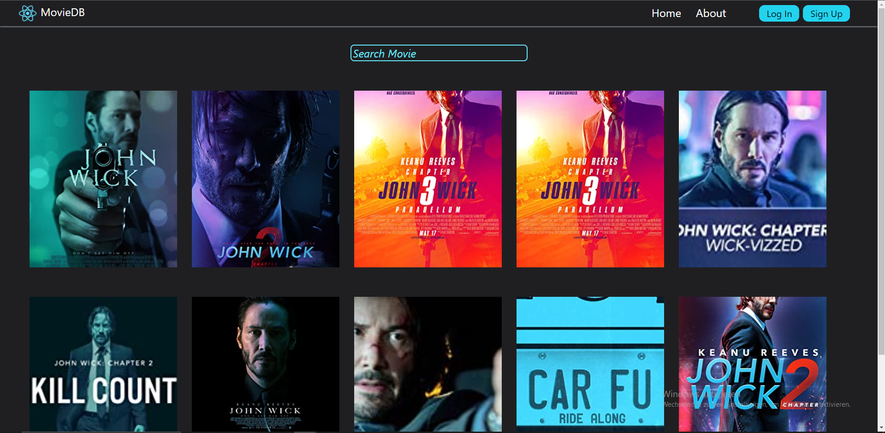

# React Movie App with TailwindCSS and React Router

One of my first React projects that didn't concentrate on specific language/framework features.

Even though it was one of the first React projects I did, I somehow thought it would be a good idea to pick up TailwindCSS while still figuring out the nitty-gritty of React.

Ended up enjoying the quality of life from TailwindCSS BUT I found it to really clutter up the files. The documentation actually helped me learn a few new things about CSS but in the end I still prefer plain CSS.

And while we are at it with somehow trying out ever possible thing I also dived head first into a custom hook. Took me quiet some time to figure out how to get it to work but in the end it was really worth it and I'll most definitely implement the custom useFetch hook in other projects as well.

First time using React Router as well. Really intuitive and easy to understand had no problems at all going through the documentaion to see how it works.

